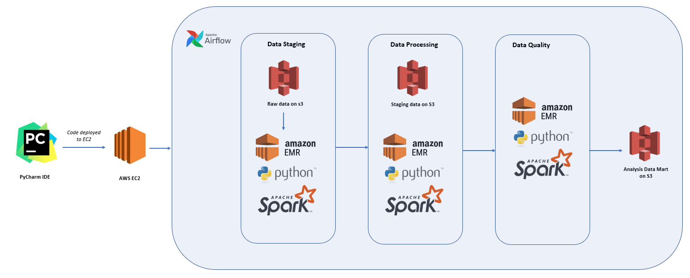
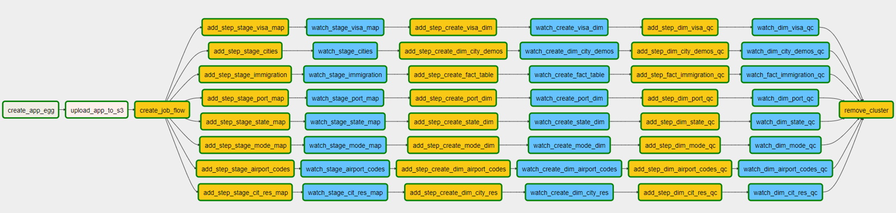

# Example ETL with Python, Spark and Airflow

### Project scope

This project demonstrates skills in data engineering, specifically in creating an efficient ETL process utilizing AWS EC2, EMR and S3, Python and Spark and orcehstrating the data pipeline with Airflow.  The output of the pipeline is a star schema that can be utilized by Business Intelligence users, Analysts and Data Scientists allowing for efficient analysis of the data, minimizing required storage space and the need for complex joins.  

Specifically the ETL pipeline ingests data related to US immigration from the following sources:

**I94 Immigration Data**: This data comes from the US National Tourism and Trade Office and contains international visitor arrival statistics by world regions and select countries (including top 20), type of visa, mode of transportation, age groups, states visited (first intended address only), and the top ports of entry (for select countries).  The original source for the data is [here](https://travel.trade.gov/research/reports/i94/historical/2016.html)

**U.S. City Demographic Data:**: Demographic data for world cities.  The data can be found [here](https://public.opendatasoft.com/explore/dataset/us-cities-demographics/export/)  

**Airport Code Table**:  Dataset containing airport codes and information on the airport such as country, municipality, lattitude and longitude.  The data can be found [here](https://datahub.io/core/airport-codes#data)

### Infrastructure Set-Up

The digaram below illustrates the infrastructure set-up utilized for the pipeline:

PyCharm was used for an IDE and was set-up to automatically deploy code changes to an EC2 cluster on AWS.  Airflow was installed on the EC2 and orchestrated 3 separate processes:

1. **Data Staging:**  Reads raw data from an S3 bucket including data in SAS format, csv and txt and stages the data as parquets in S3.  Raw data files are profiled to understand top categorical values, mean, min, max and standard deviation of numeric columns, number of rows and columns
2. **Data Processing:**  Cleans and processes the data including appropriate missing value treatment, removes columns not required, casts columns to appropriate data types, renames columns and splits columns into separate columns where required
3. **Data quality checks:**  Cleaned data is then checked for quality specifically DataFrames are checked to ensure that there are no missing values, that they have the expected number of columns, that they are not empty and that each column has the expected data type.  Processed and checked data is then stored in a separate Analysis Data Mart for business users

Spark was chosen for data processing as it allows for fast parallel processing of massive amounts of data and has easy to use APIs including support for SQL.  While the data volumes are currently small, utilizing Spark allows for the process to easily scale e.g. if data volumes were increased by 100X by adding more resources to EMR clusters.  Utilizing EMR also allows the solution to scale as more clusters and resources can be added as more people require access to the data.

Airflow allows for the code to be automated and scheduled freeing up data engineering resources.  For example, if the process was required to be run at 7am every morning, utilizing Airflow would allow the ETL process to be easily scheduled to accomplish this goal.

### Airflow Orchestration

Link to airflow install...
